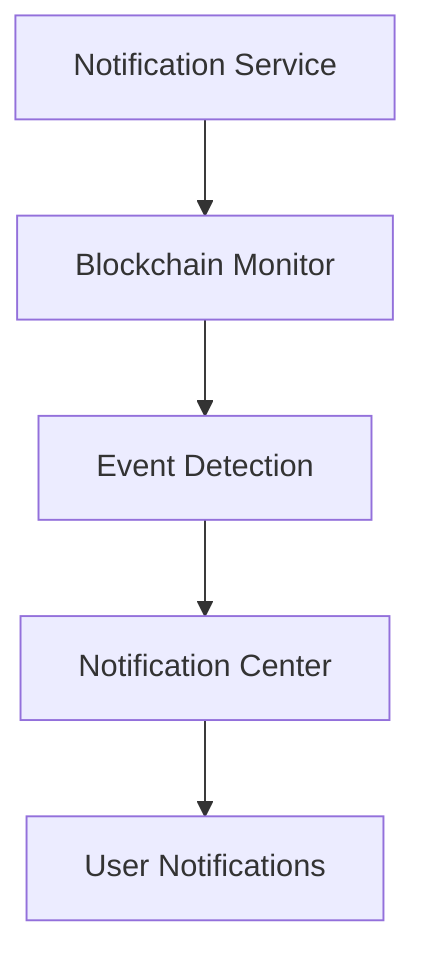

# Giveth Notification Service

## 1. Project Overview

### Purpose
The Giveth Notification Service is a critical component of the Giveth ecosystem that monitors blockchain events and sends notifications. It plays a vital role in keeping users informed about important on-chain activities and updates.

### Key Features
- Multi-chain monitoring support
- Real-time event detection
- Customizable notification rules
- Scalable architecture
- Robust error handling and logging

### Live Links
- Production: [Production URL]
- Staging: [Staging URL]

## 2. Architecture Overview

### System Diagram


### Tech Stack
- TypeScript
- Node.js
- Ethers.js
- Web3.js
- SQLite
- PM2
- Docker

### Data Flow
1. Service monitors specified blockchain networks
2. Detects relevant events and transactions
3. Processes events through notification rules
4. Sends notifications to appropriate channels
5. Logs all activities for monitoring and debugging

## 3. Getting Started

### Prerequisites
- Node.js (version specified in .nvmrc)
- Yarn package manager
- Docker (for containerized deployment)
- SQLite

### Installation Steps
1. Clone the repository:
   ```bash
   git clone https://github.com/Giveth/giveconomy-notification-service.git
   cd giveconomy-notification-service
   ```

2. Install dependencies:
   ```bash
   yarn install
   ```

3. Set up environment variables:
   ```bash
   cp .env.example .env
   # Edit .env with your configuration
   ```

### Configuration
Required environment variables:
- `NODE_ENV`: Environment (development/staging/production)
- `DATABASE_PATH`: Path to SQLite database
- `BLOCKCHAIN_RPC_URL`: RPC endpoint for blockchain connection
- Additional chain-specific configurations

## 4. Usage Instructions

### Running the Application
Development mode:
```bash
yarn dev
```

Production mode:
```bash
yarn start
```

Docker deployment:
```bash
docker-compose up -d
```

### Testing
Run linting:
```bash
yarn tslint
```

Fix linting issues:
```bash
yarn tslint:fix
```

### Common Tasks
Build the application:
```bash
yarn build
```

Start with PM2:
```bash
yarn serve
```

## 5. Deployment Process

### Environments
- Development: Local development setup
- Staging: Pre-production testing environment
- Production: Live production environment

### Deployment Steps
1. Build the application:
   ```bash
   yarn build
   ```

2. Deploy using Docker:
   ```bash
   docker-compose -f docker-compose-production.yml up -d
   ```

### CI/CD Integration
The project uses GitHub Actions for CI/CD. Workflows are defined in the `.github/workflows` directory.

## 6. Troubleshooting

### Common Issues
1. **Database Connection Issues**
   - Verify SQLite database path
   - Check file permissions
   - Ensure database schema is up to date

2. **Blockchain Connection Problems**
   - Verify RPC endpoint
   - Check network connectivity
   - Validate chain configuration

### Logs and Debugging
Logs are stored in the `logs` directory. Use the following commands to view logs:

```bash
# View all logs
tail -f logs/*.log

# View error logs
tail -f logs/error.log
```

For more detailed debugging, set the log level in the configuration file. 